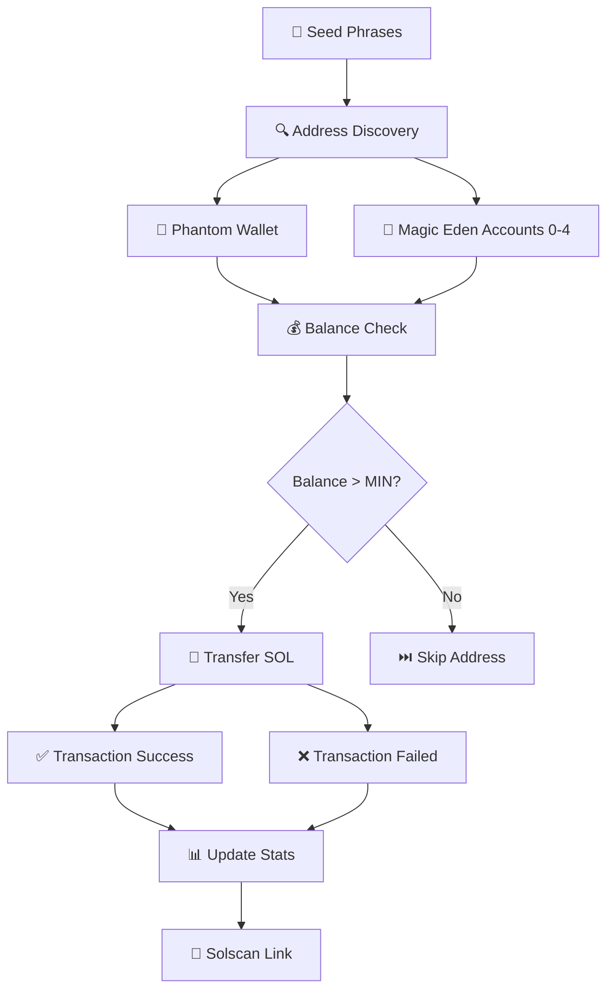
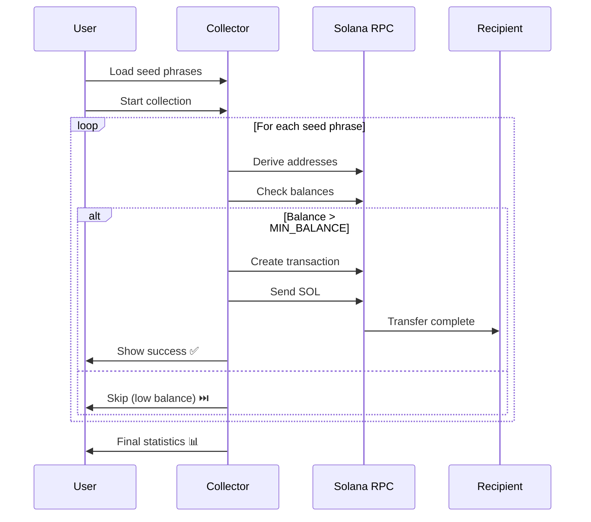
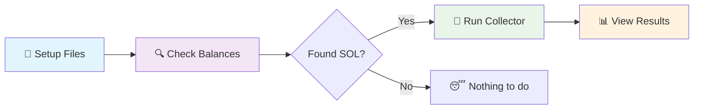
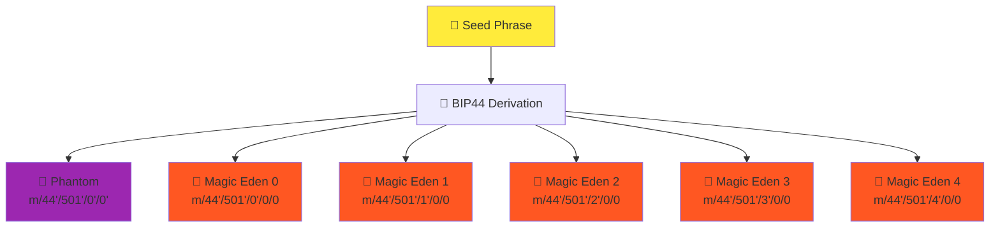
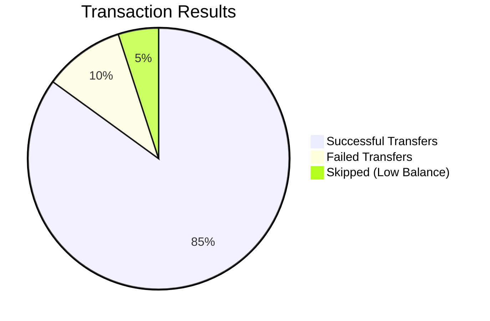

# 🧹 Solana Garbage Collector

A powerful Python tool for collecting and consolidating SOL tokens from multiple wallet addresses derived from seed phrases. Perfect for cleaning up scattered funds across Phantom wallet and Magic Eden accounts.

## 🎯 Project Overview



## 🏗️ Architecture Flow



## ✨ Features

- 🔍 **Multi-wallet scanning**: Checks both Phantom and Magic Eden wallet addresses
- 💸 **Automated transfers**: Sends all available SOL to specified recipient addresses
- 📊 **Real-time statistics**: Tracks successful/failed transactions and total SOL sent
- 🔗 **Solscan integration**: Provides direct links to transaction details
- ⏱️ **Rate limiting**: Configurable delays to avoid RPC throttling
- 💰 **Price tracking**: Shows USD values using live SOL prices
- 🛡️ **Error handling**: Robust error handling with retry mechanisms

## 📁 Project Structure

```
solana_garbage_collector/
├── 📄 README.md                 # This file
├── 📋 requirements.txt          # Python dependencies
├── 📤 sender.py               # Sender script
├── 🔍 checker.py              # Balance checking utility
├── 🌱 seed.txt                # Your seed phrases (one per line)
└── 📮 to_send.txt             # Seed phrase and recipient pairs
```

## 🚀 Quick Start

### 1. Installation

```bash
# Clone or download the project
git clone <your-repo-url>
cd solana_garbage_collector

# Install dependencies
pip install -r requirements.txt
```

### 2. Configuration

Create your input files:

**seed.txt** - List your seed phrases (one per line):
```
your first seed phrase here
your second seed phrase here
```

**to_send.txt** - Map seed phrases to recipient addresses:
```
your first seed phrase here;9WzDXwBbmkg8ZTbNMqUxvQRAyrZzDsGYdLVL9zYtAWWM
your second seed phrase here;9WzDXwBbmkg8ZTbNMqUxvQRAyrZzDsGYdLVL9zYtAWWM
```

### 3. Usage Workflow



#### Check Balances First
```bash
python checker.py
```
This will show you all balances across Phantom and Magic Eden wallets with USD values.

#### Collect and Send SOL
```bash
python collector.py
```
This will automatically collect SOL from all discovered addresses and send to recipients.

## 🔧 Configuration Options

Edit the constants in `collector.py`:

```python
NUM_ACCOUNTS = 5        # Number of Magic Eden accounts to check
MIN_BALANCE = 0.001     # Minimum balance to attempt transfer (SOL)
COMMISSION = 0.001      # Amount to leave for rent exemption (SOL)
WALLET_PAUSE = 3        # Pause between wallets (seconds)
```

## 📊 Address Types Supported



## 🛡️ Security Features

- ✅ Rent exemption protection (leaves small amount for account rent)
- ✅ Transaction confirmation checking
- ✅ Proper error handling and retries
- ✅ Rate limiting to prevent RPC throttling

## 📈 Sample Output

```
🚀 Начинаем обработку 2 кошельков...

📝 Кошелек 1/2
Сидка: 
Recipient: 

Phantom  | Address:  | Balance: 0.029023 SOL
   Отправляем 0.028023 SOL на  (Phantom)...
   ✅ Транзакция успешна: 
   Solscan: https://solscan.io/tx/

============================================================
📊 ИТОГОВАЯ СТАТИСТИКА
============================================================
Обработано кошельков: 2
✅ Успешных переводов: 3
❌ Неудачных переводов: 0
💰 Всего отправлено SOL: 0.456789
📈 Процент успеха: 100.0%
============================================================
```

## 💡 Process Visualization



## ⚠️ Important Notes

- **Testnet vs Mainnet**: Currently configured for Solana mainnet. Change RPC_URL for testnet.
- **Gas Fees**: Each transaction costs ~0.000005 SOL in fees.
- **Rent Exemption**: Solana accounts need ~0.00203928 SOL for rent exemption.
- **Rate Limits**: Free RPC endpoints have rate limits. Consider using paid RPC for heavy usage.

## 🔗 Useful Links

- [Solana Documentation](https://docs.solana.com/)
- [Solscan Explorer](https://solscan.io/)
- [Phantom Wallet](https://phantom.app/)
- [Magic Eden](https://magiceden.io/)

## 📝 License

This project is for educational purposes. Use responsibly and ensure you have proper authorization for all wallet addresses being accessed.

**⚠️ Disclaimer**: Always test with small amounts first. This tool handles real cryptocurrency transactions. Use at your own risk.
